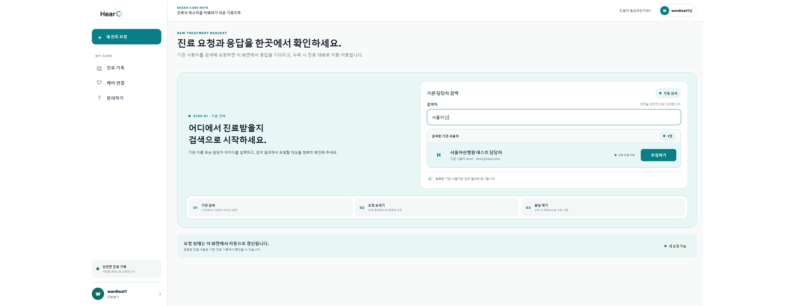
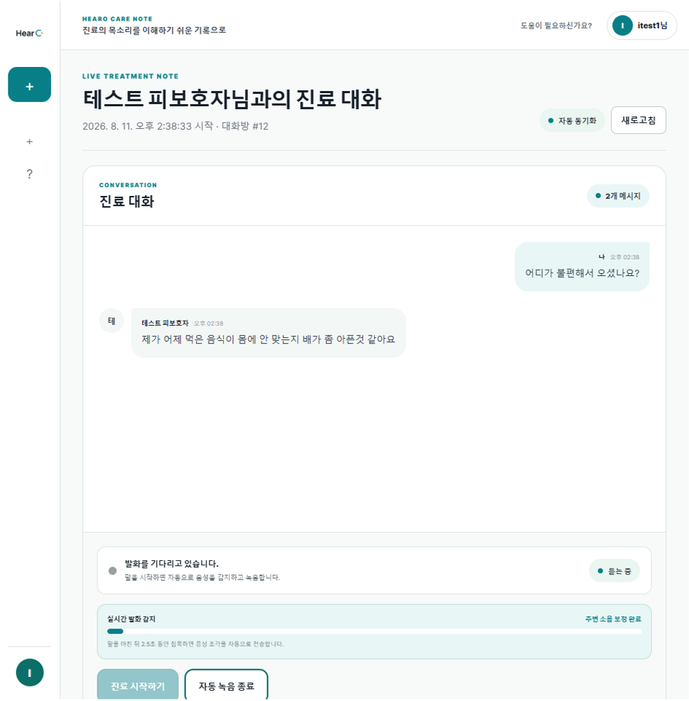
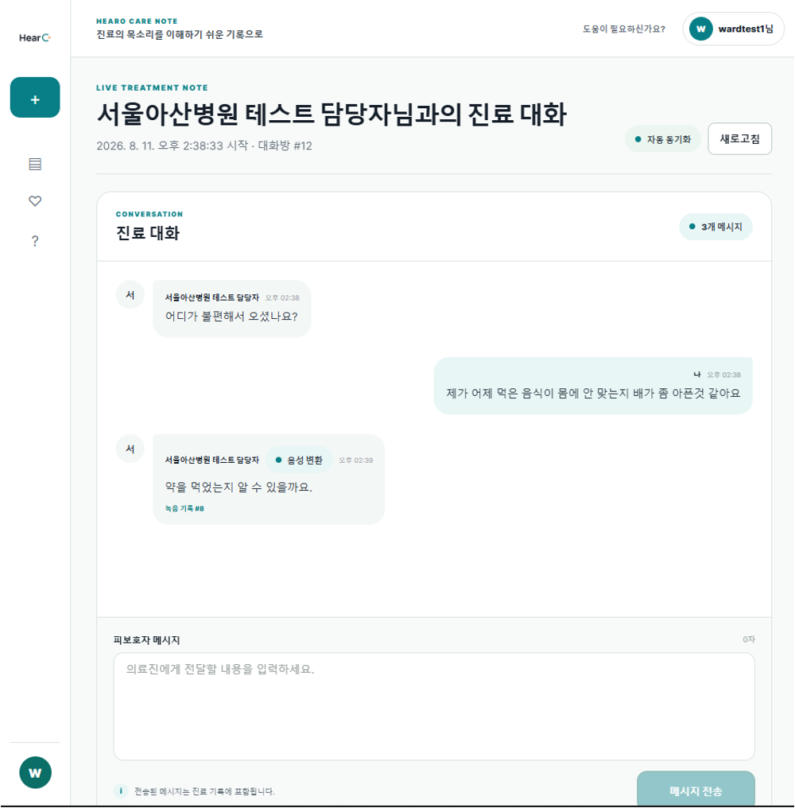
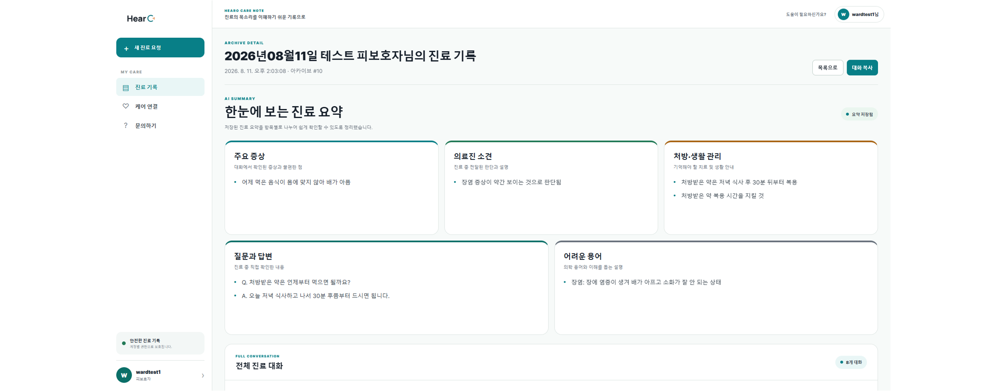
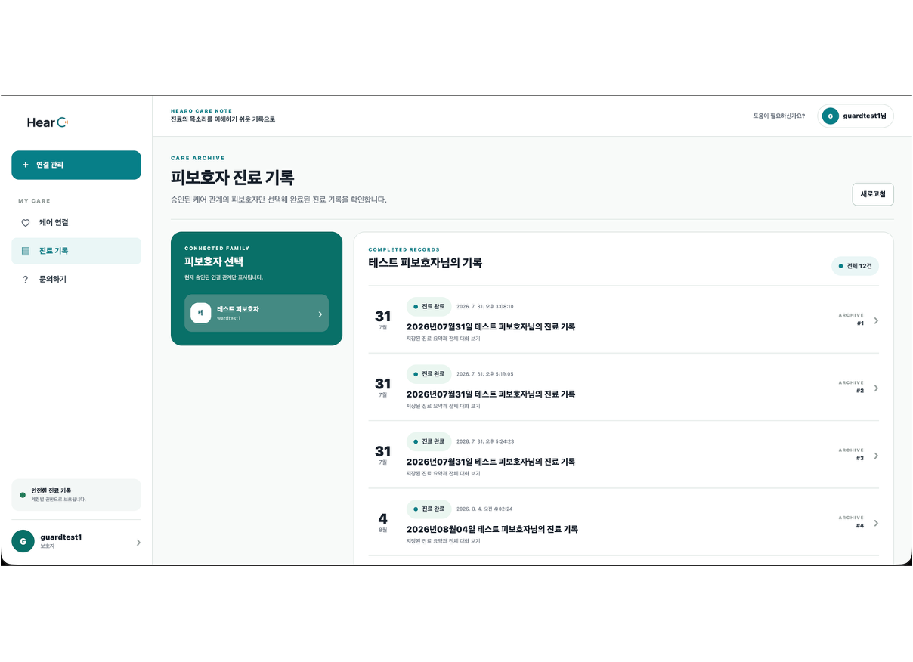
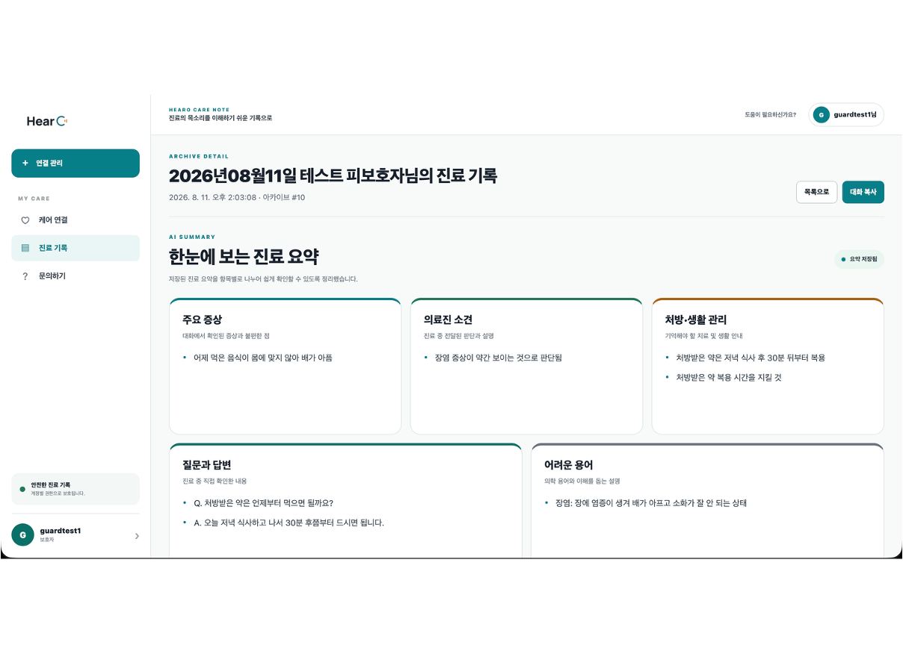
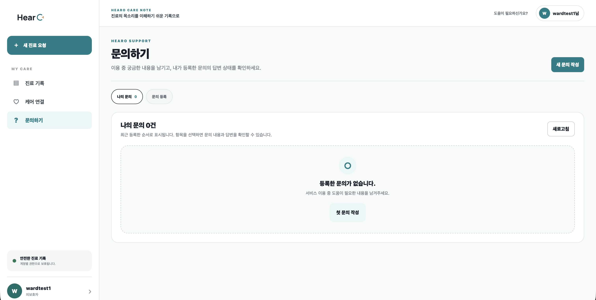
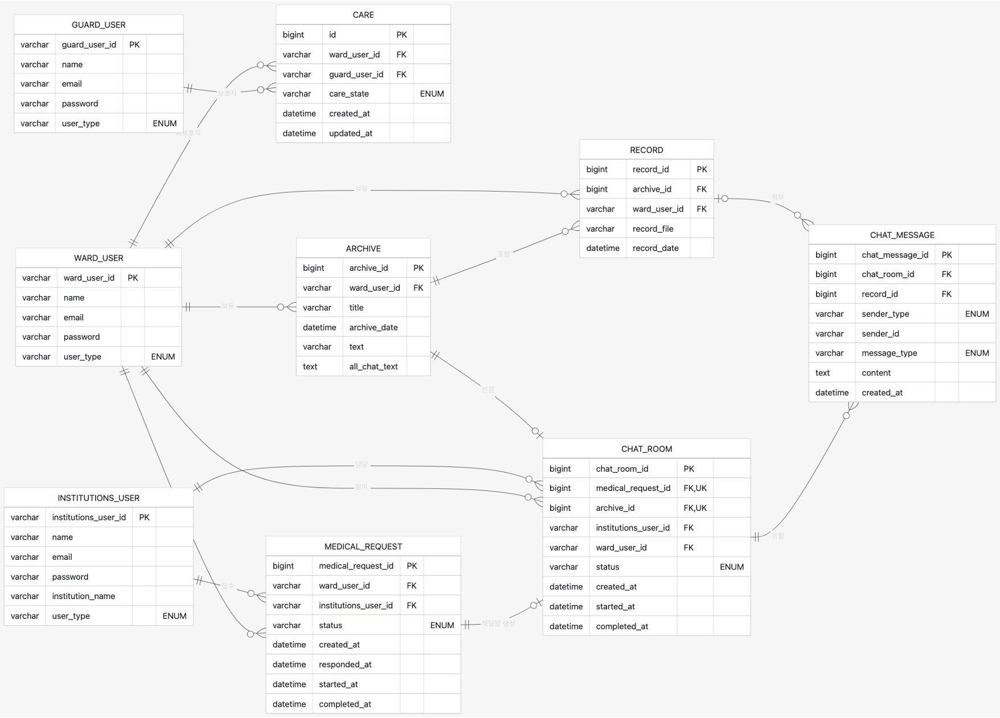

<div align="center">

# hearO

### 들리지 않아도, 진료의 모든 정보가 닿을 수 있도록

실시간 음성인식(STT)과 AI 요약 기술로  
청각장애인의 의료기관 이용 과정 전반에서 정보 접근성과 의사소통 편의성을 높입니다.

</div>

---

## 🩺 프로젝트 소개

🏷️ **프로젝트명:** hearO  
👥 **구성원:** 양준형, 송도훈, 강윤모, 임세훈  
🎯 **목표:** 병원에서 청각장애인이 겪는 의사소통의 어려움을 해결

### 기획 배경

> “청각장애인은 병원에서 의료진과 어떻게 실시간으로 소통할 수 있을까?”

청각장애인은 병원·공공기관을 이용할 때 수어통역 인력 부족과 지역별 서비스 편차로 원활한 의사소통에 어려움을 겪습니다. 필담과 예약제 통역만으로는 즉각적인 정보 전달이 어렵고, 응급상황에서는 그 한계가 더욱 커집니다.

이러한 의사소통의 공백을 줄이고, 누구나 필요한 의료 정보를 바로 확인할 수 있도록 **hearO**를 기획했습니다.

### 서비스 소개

> 의료진의 음성을 실시간 자막으로, 진료 내용을 이해하기 쉬운 기록으로

- 의료진의 음성을 STT로 변환해 실시간 자막으로 제공합니다.
- 진료가 끝나면 AI가 주요 증상, 의료진 소견과 처방 내용을 정리합니다.
- 청각장애인과 보호자가 진료 내용을 언제든 다시 확인할 수 있습니다.

## ✨ 핵심 기능

| 01 | 02 | 03 | 04 |
|---|---|---|---|
| **진료 연결** | **실시간 기록** | **AI 진료 요약** | **보호자 공유** |
| 기관 또는 담당자를 검색해 진료를 요청합니다. | 의료진의 음성을 실시간 자막으로 변환하고 대화를 화자별로 기록합니다. | 증상, 의료진 소견, 처방, 질문과 답변을 한눈에 정리합니다. | 승인된 보호자가 완료된 진료 기록을 함께 확인합니다. |

## 🔄 서비스 흐름

```text
기관·담당자 검색 → 진료 요청·수락 → 실시간 대화 기록
        → 진료 종료 → AI 진료 요약 → 환자 확인·보호자 공유
```

## 🖥️ 서비스 화면 및 기능

### 01. 기관을 찾고 진료를 요청합니다

청각장애인 사용자가 기관 또는 담당자를 검색해 진료를 요청합니다. 담당자가 요청을 수락하면 양쪽 사용자가 같은 진료방으로 자동 연결됩니다.



<div align="center">↓</div>

### 02. 진료 대화를 실시간으로 기록합니다

청각장애인과 기관 담당자의 대화를 화자별 메시지로 보여줍니다. 담당자의 발화를 자동으로 감지하고 음성을 실시간 자막으로 변환해 진료 기록에 반영합니다.

<table>
  <tr>
    <td align="center" width="50%"><strong>청각장애인 사용자 화면</strong></td>
    <td align="center" width="50%"><strong>기관 담당자 화면</strong></td>
  </tr>
  <tr>
    <td></td>
    <td></td>
  </tr>
</table>

<div align="center">↓</div>

### 03. AI가 진료 내용을 한눈에 정리합니다

진료가 끝나면 전체 대화를 분석해 주요 증상, 의료진 소견, 처방·생활 관리, 질문과 답변, 어려운 의학 용어를 청각장애인이 다시 확인하기 쉬운 구조화된 기록으로 제공합니다.



<div align="center">↓</div>

### 04. 승인된 보호자가 진료 기록을 함께 확인합니다

보호 관계가 승인된 사용자는 연결된 피보호자의 진료 목록을 확인하고, 필요한 기록을 선택해 AI 요약을 함께 볼 수 있습니다.

<table>
  <tr>
    <td align="center" width="50%"><strong>피보호자 진료 기록</strong></td>
    <td align="center" width="50%"><strong>진료 요약 상세</strong></td>
  </tr>
  <tr>
    <td></td>
    <td></td>
  </tr>
</table>

<div align="center">↓</div>

### 05. 서비스 이용 중 필요한 도움을 요청합니다

사용자는 문의를 등록하고 답변 상태를 확인할 수 있습니다.



## 🛠️ 기술 스택

### Frontend

<p>
  
  
  
</p>

### Backend

<p>
  
  
  
  
  
</p>

### AI

<p>
  
  
  
</p>

### Infrastructure

<p>
  
  
  
  
  
</p>

## 📐 프로젝트 설계

### 시스템 아키텍처

```text
Web · iOS · Android
Expo · React Native · TypeScript
             │
             │ REST API · JWT
             ▼
Spring Boot Application Backend
MySQL · Redis · QueryDSL
       │                 │
       │ Speech-to-Text  │ Final Report
       ▼                 ▼
Speech Recognition    Flask AI Service
                      OpenAI API

GitHub Actions → Amazon ECR → Kubernetes → Argo CD
```

### ERD

피보호자·보호자 관계, 의료기관 사용자, 진료 요청, 실시간 대화방, 메시지와 진료 아카이브의 관계를 중심으로 설계했습니다.



## 📦 Repositories

- [**frontend**](https://github.com/fourdushes/frontend) — 피보호자·보호자·기관 사용자를 위한 hearO Web·iOS·Android 클라이언트
- [**backend**](https://github.com/fourdushes/backend) — 인증, 보호 관계, 진료 요청, 실시간 대화와 진료 기록을 담당하는 Spring Backend
- [**ai_service01**](https://github.com/fourdushes/ai_service01) — 진료 대화를 청각장애인이 다시 확인하기 쉬운 최종 보고서로 변환하는 AI Summary API

## 👥 팀원 소개

<table>
  <tr>
    <td align="center" width="25%">
      <a href="https://github.com/Songdoyang">
        <br/>
        <strong>송도훈</strong>
      </a><br/>
      AI · STT
    </td>
    <td align="center" width="25%">
      <a href="https://github.com/yangjoonhyung">
        <br/>
        <strong>양준형</strong>
      </a><br/>
      Full-stack · Architecture
    </td>
    <td align="center" width="25%">
      <a href="https://github.com/gang-mo">
        <br/>
        <strong>강윤모</strong>
      </a><br/>
      Cloud Infrastructure
    </td>
    <td align="center" width="25%">
      <a href="https://github.com/Nublas77">
        <br/>
        <strong>임세훈</strong>
      </a><br/>
      Frontend · Business
    </td>
  </tr>
</table>

| 팀원 | GitHub | 담당 업무 |
|---|---|---|
| **양준형** | [@yangjoonhyung](https://github.com/yangjoonhyung) | 서비스 기획, ERD 설계, 아키텍처 설계, 프론트엔드·백엔드 개발 |
| **송도훈** | [@Songdoyang](https://github.com/Songdoyang) | AI 상담 내용 정리 및 요약 기능, 텍스트 정제 및 성능 최적화, 실시간 자막(STT) 기능 제작 |
| **강윤모** | [@gang-mo](https://github.com/gang-mo) | 클라우드 인프라 구축, 모델 서버 연동, 인프라 운영 |
| **임세훈** | [@Nublas77](https://github.com/Nublas77) | 마케팅, 재무, 프론트엔드 개발 |

## hearO가 만드는 변화

- 청각장애인이 의료진의 말을 실시간 자막으로 즉시 확인할 수 있습니다.
- 통역 인력의 부족과 지역별 서비스 편차를 디지털 기술로 보완합니다.
- 응급상황에서도 필요한 정보를 빠르게 주고받을 수 있도록 지원합니다.
- 어려운 의료 정보를 구조화된 기록으로 제공해 정보 전달의 정확성을 높입니다.
- 진료가 끝난 이후에도 본인과 보호자가 같은 정보를 다시 확인할 수 있습니다.

---

<div align="center">

**hearO**  
들리지 않아도, 필요한 정보는 바로 닿을 수 있도록.

</div>
